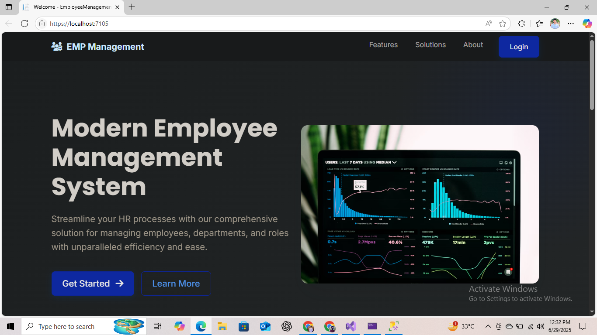
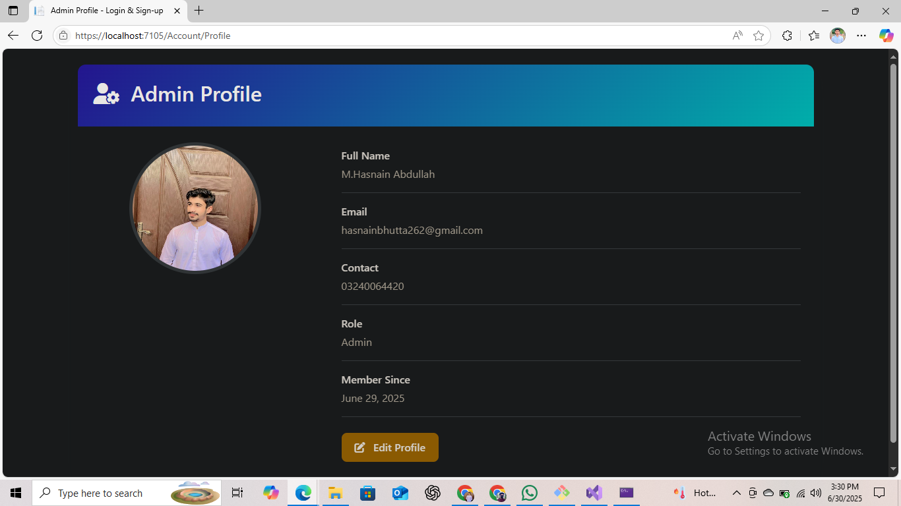
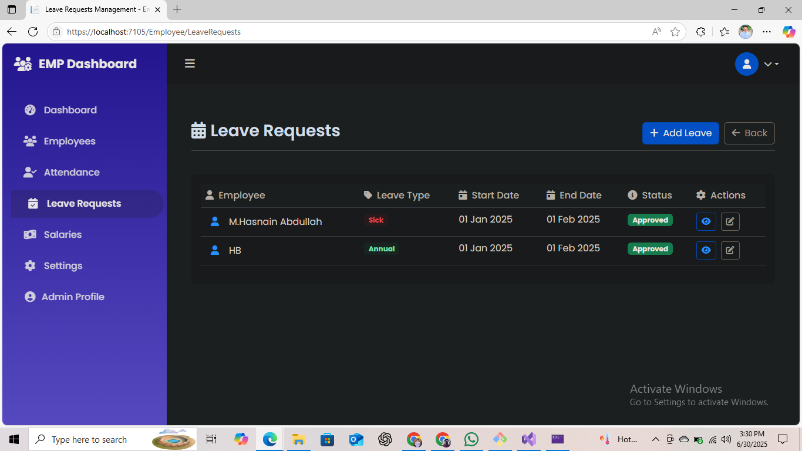
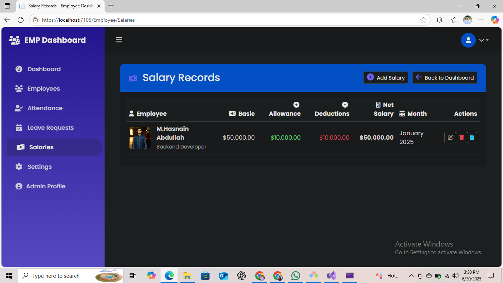
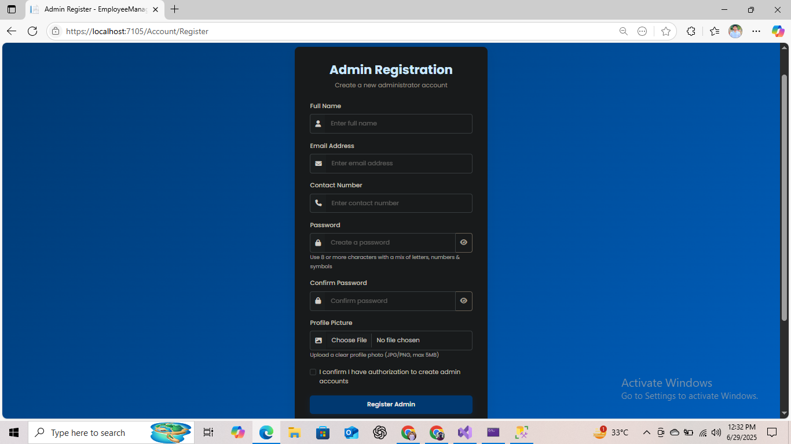
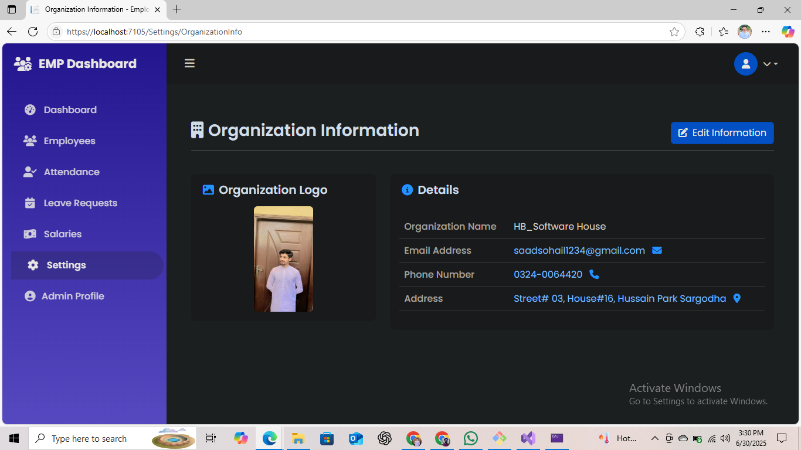

# Employee Management System 👨‍💼

A complete web-based **Employee Management System** built with ASP.NET MVC and Entity Framework Core.  
This system helps manage employees, attendance, salary, leave requests, and much more — all through a clean dashboard interface.

---

## 🧠 Project Features

- 🔐 Role-Based Authentication (Admin, Employee)
- 🧾 Employee CRUD (Create, Read, Update, Delete)
- 📅 Attendance Tracking
- 💸 Salary Management
- 📝 Leave Requests
- ⚙️ Settings Panel
- 🖼️ Image & File Uploads
- 📊 Dashboard for Admin & Employees

---

## ⚙️ Tech Stack

| Layer            | Technology               |
|------------------|---------------------------|
| Frontend         | HTML, CSS, Bootstrap     |
| Backend          | ASP.NET MVC (.NET 8)     |
| Database         | SQL Server               |
| ORM              | Entity Framework Core    |
| Authentication   | ASP.NET Identity + Roles |
| Hosting          | GitHub / Local IIS       |

---

## 🚀 Setup Instructions

1. Clone the repository  
```bash
git clone https://github.com/HBDeveloper-62/EmployeeManagementSystem.git
```

2. Open the solution file in Visual Studio:  
   `EmployeeManagementSystem.sln`

3. Run the following commands in **Package Manager Console**:  
```bash
Update-Database
```

4. Press `F5` to run the application.

---

## 📸 Screenshots

### 🔹 Startup Page


### 🔹 Admin Dashboard


### 🔹 Employee Dashboard


### 🔹 Attendance Management


### 🔹 Leave Requests


### 🔹 Salaries Section


### 🔹 Signup Page


### 🔹 Settings Panel


---

## 👤 Author

**HB .Net Developer**  
📧 hasnainbhutta262@gmail.com  
🌍 Pakistan  

---

## 📃 License

This project is licensed under the MIT License — feel free to use and customize.
